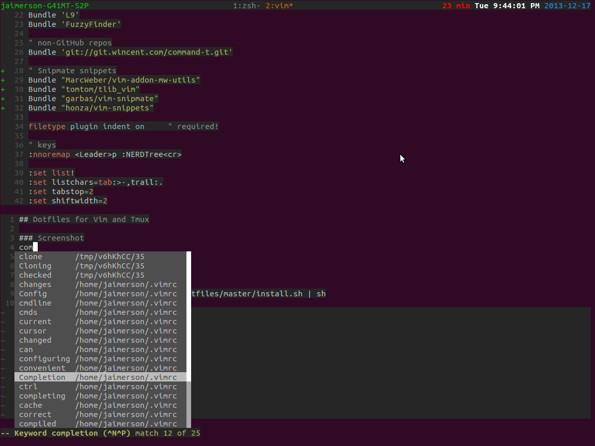

## Dotfiles for Vim and Tmux

### Screenshot


### Plugins used
* vundle
* vim-bundler
* vim-rails
* vim-fugitive
* ctrlp-vim
* numbers
* nerdtree
* nerdcommenter
* emmet-vim
* vim-snipmate
* supertab

### Install

```
curl https://raw.github.com/ottony/dotfiles/master/install.sh | sh
```
